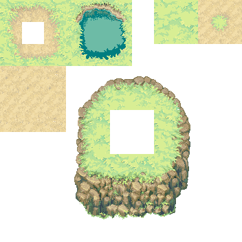
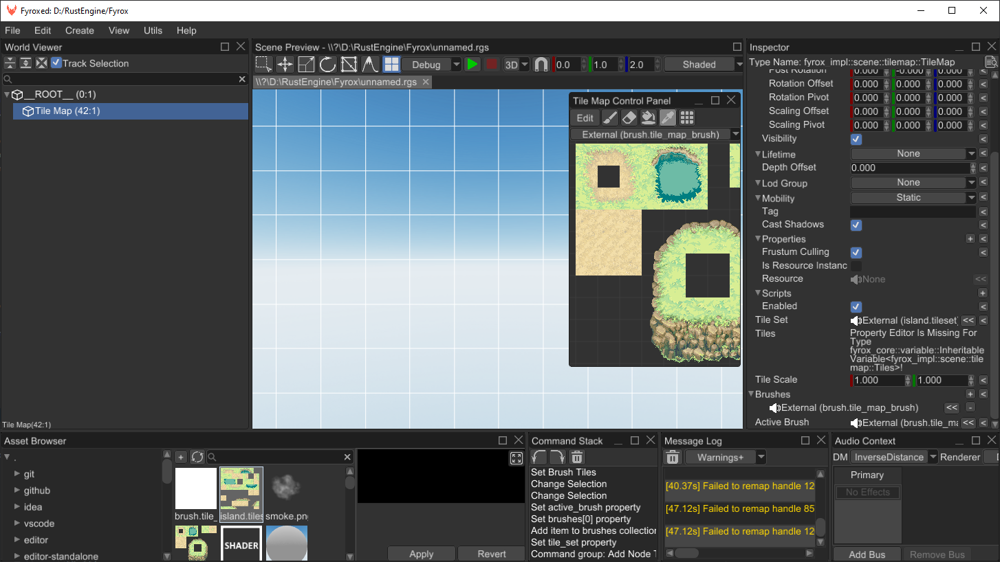
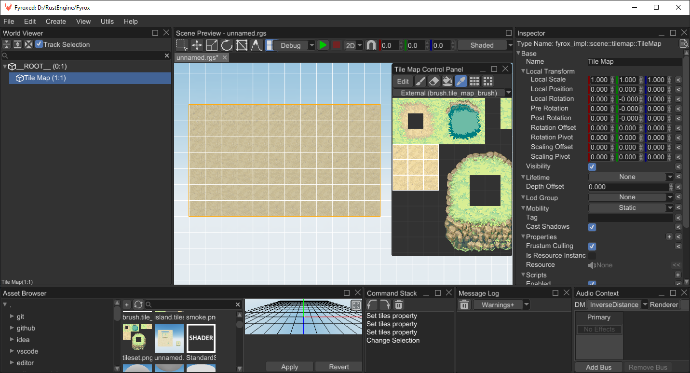
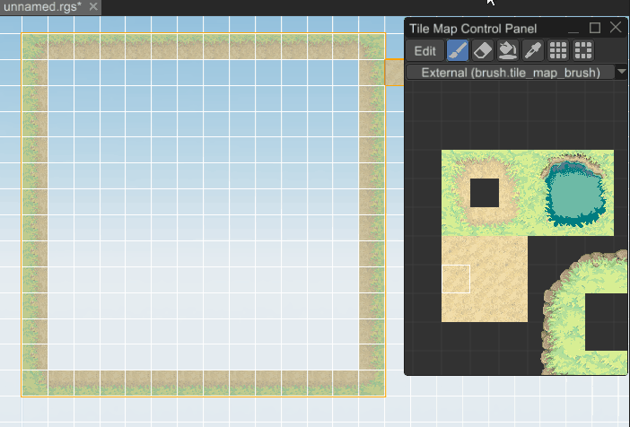
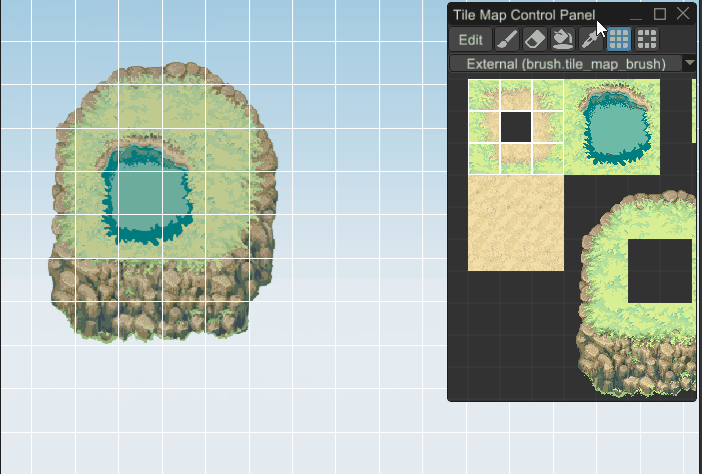
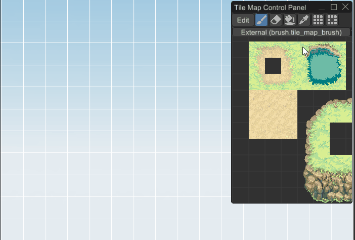
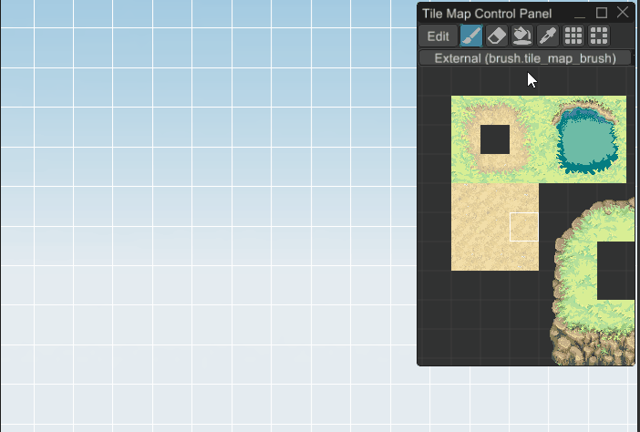

# Tile Map

Tile map is a 2D "image", made out of a small blocks called tiles. Tile maps used in 2D games to build game worlds 
quickly and easily. 

> ⚠️ This functionality is available only on nightly version of the engine and will be a part of the next stable release.
> If you want to use it, read [this chapter](../beginning/scripting.md#using-the-latest-engine-version) to learn how to
> switch to the nightly version of the engine.

An example of a tile map could be something like this:


## How to Create

A tile map comes in two pieces: A `TileMap` node that can be added to a scene, and a `TileSet` resource that holds the
data required to render each tile.

Tiles in a tile set are organized into pages. Each page has a position on a 2D grid along with all the other pages in the
tile set, and each page contains another 2D grid where the tiles are arranged. Pages and tiles can be positioned anywhere
on their grids according to whatever organizational principles you please. The chosen position for each tile becomes its
handle, called a `TileDefinitionHandle`, and this handle is what will be stored in the tile map to determine how to render
the tiles.

Here is an example handle: `(0,2):(-3,5)`. This handle means that the tile is on the page at coordinates
(0,2) and the tile data is at (-3,5) within that page's grid.

Tile set pages come in multiple varieties depending on what data will be stored in each grid cell of the page.

* **Atlas:** An atlas page renders all of its tiles using a single shared material that acts as a sprite sheet.
  The material starts at the upper-left corner of tile (0,-1) and extends down into negative-y cells and right
  into positive-x cells. Any tiles that you add to an atlas page will be rendered with their UV-coordinates based
  on their position on the page
  relative to the material.
* **Freeform:** A freeform page is a collection of tiles with their own independent materials and UV-coordinate positions.
  Unlike an atlas page, the positions of tiles in a freeform page does not matter, but each tile needs to have its
  material and UV-coordinates specified manually. Tile UV-coordinates are measured in pixels of the texture, not
  from 0.0 to 1.0.
* **Transform:** A transform set page stores handles to tiles on other pages and represents how tiles may be flipped
  or rotated. The page is divided into 2x4 sets of cells. Within each set, the left 2x2 cells hold tiles that may be
  transformed into each other by 90-degree rotations. The right 2x2 cells represent same tiles horizontally mirrored.
  The tile set resource can search its transform pages to convert any handle into the handle of a flipped or rotated
  version of the tile.
* **Animation:** In the future there may be animation pages that store sequences of handles that will cause the tile
  map to animate by moving through the sequences over time.

Once we have a tile set resource, we can create a tile map node and set its `tile_set` field to point to our resource.
Then we can fill the tile map node with the handles for whatever tiles we want to render.

As usual, there are two major ways of creating a tile map - via code or via the editor. Code-based approach is ideal for
procedural worlds, while the editor-based approach is good for hand-crafted worlds.

### Code

The following example creates a simple tile map with two tile types - grass and stone. It creates stone foundation and 
lays grass on top of it.

```rust
{{#include ../code/snippets/src/scene/tilemap.rs:create_tile_map}}
```

Please refer to the API docs for more info about each method.

### Editor

Editor-based approach requires a bit of preparation, yet it is still simple. First you need a tile set, something like this:



It is a 11x11 sprite sheet for a top-down game. Now you need to create a tile set resource from this tile set. Navigate
the asset browser and click on `+` button near the search bar. Select `TileSet` resource and click `OK`. Find the resource
you've just created in the asset browser, then double-click on it to open the tile set editor.


#### Creating an Atlas Page

Now it is time to create the first page for our new tile set. Click anywhere in the upper grid to select the position for
the page, then click the "Tile Atlas" button under "Create New Page" on the right side of the editor.

Because the selected page position is no longer empty, the "Create New Page" menu is replaced by an inspector for the
properties of the new atlas page. Here you can edit the material for the tiles and change the size of the tiles as measured
in texture pixels. These properties can be changed at any time, and the resulting changes will affect all the tiles of the page.

Once you have set your sprite sheet as the texture for the material, the texture will become visible in the lower grid of the
editor. Use the scroll wheel to zoom and pan if necessary to see all of it. This is only a *preview* of what the tiles might
look like; the tiles have not yet been created, and the texture is faded to distinguish it from actual tiles.
You can adjust the fade using the "Material Tint" color field in the top-right of the editor. This has no affect on the tile
set resource; it is purely cosmetic within the editor.

To actually create some tiles, left-click and drag on the lower grid to select whatever areas of the material should have
tiles. Holding shift will allow you to select multiple areas at once. Once you are satisfied with your selection,
press the "Create Tile" button on the right side of the editor. This will fill any empty selected cells with new tiles,
covering the faded material preview with the full-color of actual tiles.

#### Creating a Freeform Page

Select any empty cell in the upper grid to cause the "Create New Page" menu to appear. Click "Free Tiles" button to
start creating freeform tiles on your tile set's new page. Unlike the atlas page, a freeform page has very few properties
to edit in the inspector. This is because each tile has its own material and size fields.

Select any empty cell in the lower grid and click "Create Tile" to begin editing the properties for a new freeform tile.
At the top is a field for choosing the material for the tile. It will initially be a blank material with the
standard tile shader. Below that are four pairs of coordinates that represent for points on the material's texture as
measured in texture pixels. The left-top point represents the left-top corner of the tile, and so on around all four
corners of the tile.

Below the tile corners are four buttons for performing flips and rotations on the corner coordinates. By changing the
coordinates of the corners of the tile, the tile can be rotated by 90 degrees and flipped horizontally and vertically.

Next there is the tile's color which can be used to apply tinting or transparency to the tile.

It is also possible to add tiles to a freeform page by painting them with tools on the Tile Map Control Panel which will
be discussed later.

#### Creating a Transform Page

Once you have prepared a library of tiles with your tile set, you may want to specify which tiles are mirrored or rotated
versions of other tiles. This will allow the tile set produce a flipped or rotated version of a tile just by giving it
the handle of the tile and the desired transformation. Start by selecting an empty page cell and clicking "Transform"
under "Create New Page."

In the lower grid area you should see that the cells have been divided into 2x4 groups. Each cell of these groups can store
a `TileDefinitionHandle` and the eight handles together will specify all possible combinations of flips and 90-degree rotations
that may be needed for a tile.

In order to fill this page with tile handles, click the "Palette" button in the upper-right to open the "Tile Map Control Panel" window,
if it is not already open. This is the same window that you will use to edit a tile map, and so it has tools designed for selecting
tile handles and putting them wherever you want them. The panel should already be showing the grid of pages from your tile set.
If the panel is showing something else, then find your tile set in the asset browser and drag it onto the panel.

Use the panel to select a page from your tile set, and then select a tile that you want to put into your transform page.
Click the button with the paint brush icon to activate the brush tool, then click in the tile set editor to paint the handle
for the selected tile into a cell of the transform page. The tools available for painting, moving, copying, and deleting
tile handles will be discussed in more detail later.

Now we have the tile set, and we can start creating a tile map using it. Click `Create -> 2D -> Tile Map` and you should
see something like this:


If you look closely, the editor warns us about missing tile set. Find the tile set you've just made and drag'n'drop it 
from the asset browser to the `Tile Set` field in the inspector. There's one more step before we can start editing the
tile map - we need a brush to paint on the tile map. Click `+` button in the asset browser and select `TileMapBrush`,
set a name for it and click `OK`. Now select the tile map scene node and click on `+` sign in the `Brushes` field, drag'n'drop
the brush you've just created to the newly created property. Navigate to the `Tile Map Control Panel` and select the
brush from the dropdown list. For now the brush is empty, the simplest way to fill it is to just drag'n'drop the tile set
to it:


At this point everything is ready for painting, click `Edit` button on the `Tile Map Control Panel` and you should see the
grid:



Select some tiles on the palette and start drawing:



## Drawing Tools

There are number of tools that could be useful while editing tile maps when in the tile map interaction mode.

### Brush Tool

The brush tool takes whatever tiles are selected and puts the handles for those tiles wherever you click on the selected tile map.
You can select any number of tiles and their handles will be drawn in the same relative positions where you click, or you can use
the flip and rotation buttons to flip and rotate the selected tiles before drawing them. The preview area of the Tile Map Control Panel
shows approximately what the tiles should look like when they are drawn.

### Erase Tool


Erases tiles using the shape of the current brush, could be activated using `2` key or by clicking on the
button with eraser icon.

### Flood Fill Tool



Fills a region with the same tile kind (or empty space) using random tiles from the current brush. Could
be activated using the button with paint bucket icon.

### Pick Tool



Picks a rectangular region of tiles from the tile map itself and turns them into the current brush.
Hold shift to add additional rectangular regions to the brush.
Hold alt to drag the currently selected tiles and move them to a different location in the tile map.
Could be activated using `1` key or by clicking the button with pipette icon.

### Rectangular Fill Tool



Fills a rectangular region with the tiles from the current brush. It tiles the given region using the
tiles from current brush. Could be activated using `3` key or by clicking on the button with the tiles icon.

### Nine Slice Tool



Fills a rectangular region using a rectangluer brush divided into nine sections: four corners, four sides, and the center.
The corners of the brush will be placed at the corners of the selected region. The sides of the brush will fill the sides
of the selected reation, and the center of the brush will fill the center of the selected region.

## Physics

Tile maps supports physics for tiles, and it could be enabled by using special collider shape called `TileMap`. In code
it could be done something like this:

```rust
{{#include ../code/snippets/src/scene/tilemap.rs:tile_map_physics}}
```

In the editor it could be done by creating a static 2D rigid body with a 2D collider that has `TileMap` shape: 


## Layers

Tile map does not support any layers on its own, but layers could be added very easy by simply creating another tile 
map with its own tile set and shifting this new layer by Z axis towards camera on some small value. 

## Tile Properties

Tile set could contain custom properties for each tile, these properties could be used to attach additional information
to the tiles in your game. This could include surface type (water, lava, dirt, etc.), physics properties (friction, 
restitution, etc.) and any other you need. This is how it could be used in a game:

```rust
{{#include ../code/snippets/src/scene/tilemap.rs:create_tile_map_with_props}}
```

Here we have two types of tiles - soil and slime, soil does not have any effect on player's movement speed, while the
slime slows down the player by 30%. This code does not actually use any physical contact information and just uses tile
position, but it could be fixed pretty easily - supply physical contact position to it, and it will return correct results. 

Tile custom properties could be edited in the tile set editor:


