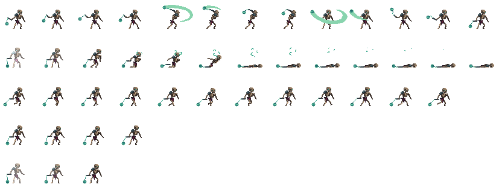
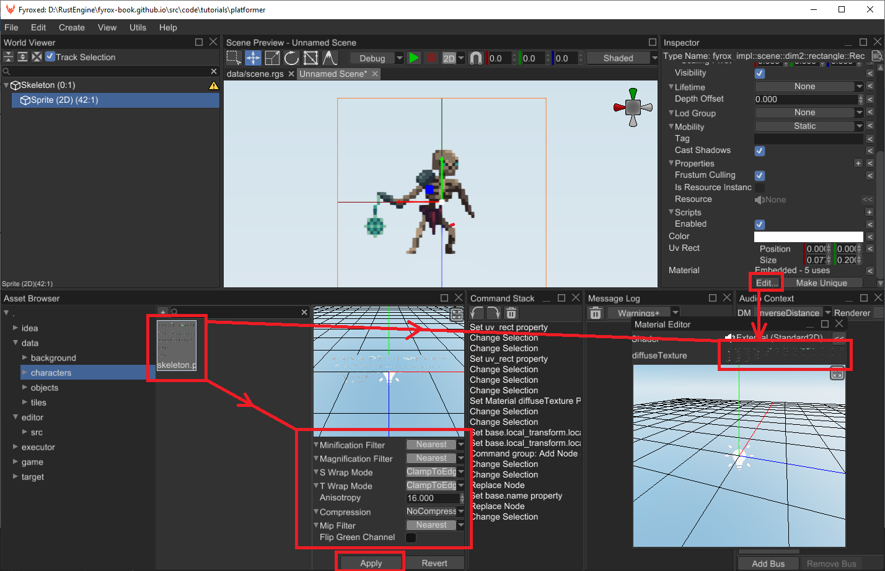
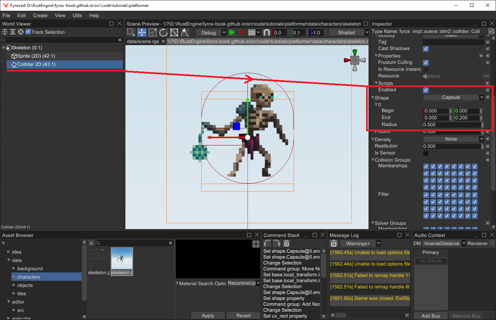
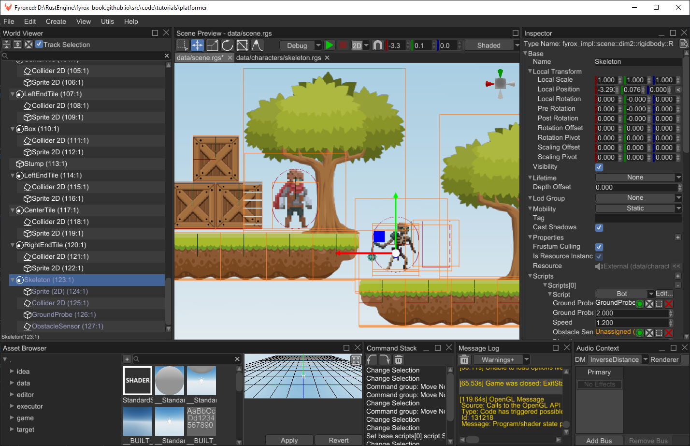
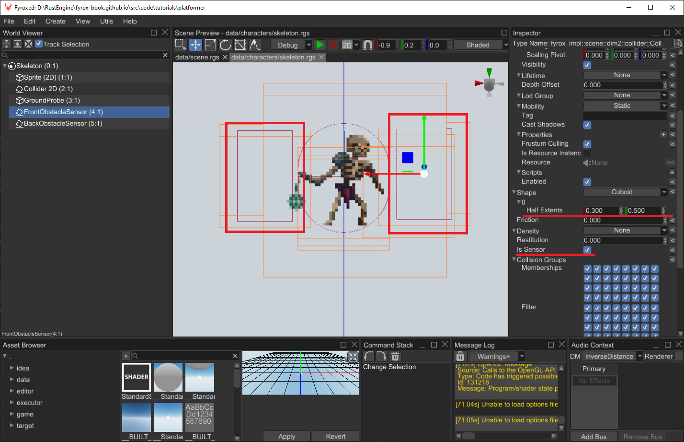
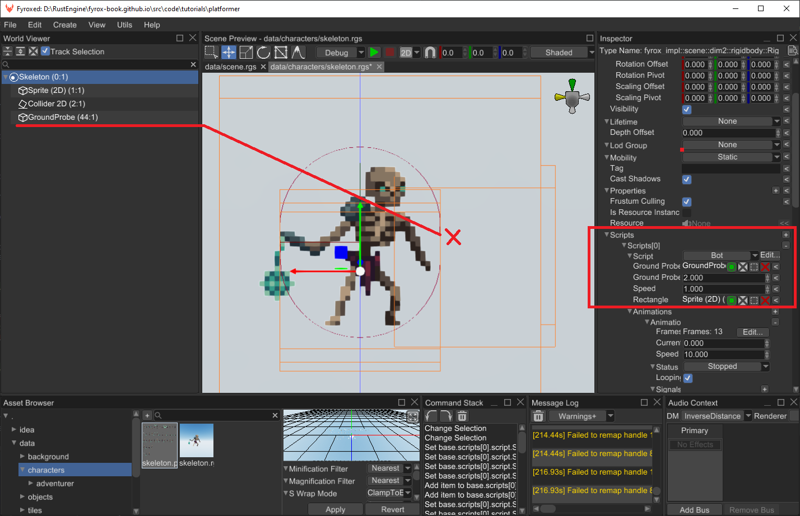

# Bots and AI

In this tutorial we'll add bots and a simple AI system to our 2D platformer. In the end we'll get something like this:


## Bot Prefab

Let's start by creating a prefab for our bots. Prefab is a separate scene, that can be instantiated at any time in some 
other scene. It allows us to make reusable and well isolated parts of the game. At first, we need a sprite sheet for the 
bot, we'll use [this one](https://astrobob.itch.io/animated-pixel-art-skeleton). It contains attack, hit, death, walk, idle animations. In this tutorial we'll use only 
walk and attack animations, other animations will be used in the next tutorial. The sprite sheet looks like this - 13x5 
sprites where every sprite is 64x64px:



Save this image in the `data/characters` folder as `skeleton.png`. Open the editor and create a new scene, right-click on 
the `__ROOT__` scene node and click on `Replace With -> Physics 2D -> Rigid Body`. Rename this node to `Skeleton` and then 
create a `Rectangle` child node by right-clicking on the `Skeleton` node and doing `Create Child -> 2D -> Rectangle`, 
select the new rectangle node and set its scale to `2.0, 2.0, 1.0` (default scale of 1.0 is too small and the skeleton 
will be half of the height of our player). Now let's apply a texture to the rectangle, find `skeleton.png` in the asset 
browser, select it, set its properties like on the screenshot below - all filtration modes to `Nearest` (to make its 
pixels sharp, not blurry) and wrapping to `Clamp To Edge` (to prevent potential seams on the edges). Find the `Material` 
property in the inspector and open the material editor, drag the `skeleton.png` texture from the asset browser to 
`diffuseTexture` property in the material editor. Set the `UV Rect -> Size` property to `0.077; 0.2` to select a single 
sprite from the sprite sheet, and you should see something similar to this:



If you look closely at the world viewer, you should notice a small warning sign near the rigid body - the editor tells 
us that we've forgotten to add a collider to the rigid body. Let's fix this by right-clicking on the rigid body, then 
select `Create Child -> Physics 2D -> Collider`. Select the collider and set its shape to `Capsule` in the properties 
like so:



We're almost finished with our prefab, the last step is to configure properties of the rigid body. Currently, we
have a simple rigid body, that will rotate freely during collisions and will also "sleep" on inactivity, which will prevent 
the body from moving. Let's fix this by selecting the rigid body in the inspector and disable rotational movement and 
prevent it from sleeping:


The "skeleton" of our skeleton (pun intended) prefab is finished, and now we can start writing some code. 

## Script

Now on to the code part, run the following command in the root folder of your game: `fyrox-template script --name=bot` and add
the `mod bot;` line at the beginning of `lib.rs` of the `game` package. The code for the script will look something like 
this:

```rust,no_run
{{#include ../../code/tutorials/platformer/game/src/residuals.rs:bot_stub_script}}
```

We need only `on_update` method, and the rest methods can be removed. Register the script by adding 
`script_constructors.add::<Bot>("Bot");` line near the `script_constructors.add::<Player>("Player");`
line in `lib.rs` (as we did in the previous part of the tutorial). We also need to import all required types for the bot,
replace all the imports at the beginning of the `bot.rs` with the following:

```rust
{{#include ../../code/tutorials/platformer/game/src/bot.rs:imports}}
```

We need to store a handle to the sprite in our script, add the following field in the `Bot` struct:

```rust
{{#include ../../code/tutorials/platformer/game/src/bot.rs:visual_fields}}
```

Open the skeleton prefab and assign the script to the root rigid body. Set the `rectangle` field to `Sprite (2D)` and 
save the prefab. Great, now let's begin writing the actual AI code of the bot.

### Patrol

By default, when there's no target nearby the bot will patrol in available bounds. Basically, it will walk from one "wall"
to another. Add the following fields to the `Bot` script:

```rust
{{#include ../../code/tutorials/platformer/game/src/bot.rs:movement_fields}}
```

`speed` field will define overall movement speed of the bot and `direction` will be used to alternate movement direction
along X axis. Open the skeleton prefab and set the speed to `1.2` and the direction to `-1.0`. Add the movement handling 
code somewhere in the `impl Bot`:

```rust
{{#include ../../code/tutorials/platformer/game/src/bot.rs:do_move}}
```

This code is quite straightforward - at first, we're doing a checked borrow of the node that contains the script. It must
be of `dim2::RigidBody` type. Then we're setting horizontal speed of body using `speed` and `direction` variables we've
added earlier. As the last step we're changing horizontal scale of the sprite using sign of the current direction. This
way we're flipping the sprite in the current direction. Now we need to call `do_move` method in `on_update` like so:

```rust
{{#include ../../code/tutorials/platformer/game/src/bot.rs:do_move_call}}
```

Open the main scene (`scene.rgs` by default) and find the skeleton prefab in the asset browser, drag'n'drop it in the 
scene and adjust its position to get something like this:



Run the game, and you should see the skeleton moving away from the player to the right. Cool, but the bot will be stuck 
immediately when it hits a wall, so we also need a way of detecting obstacles along the way, so the bot could "understand" 
when it should change movement direction. We'll use sensor collider for this purpose. Open the skeleton prefab and create 
two new 2D colliders under the root `Skeleton` node, adjust their sizes to be something similar to the following screenshot:



It is very important to have `Is Sensor` property checked on both colliders, we don't need the collider to participate 
in actual collision detection - it will be used only in intersection checks with the environment. Do not forget to assign 
handles of both `FrontObstacleSensor` and `BackObstacleSensor` to the respective fields in the `Bot` script instance on 
the root rigid body.

Now onto the movement algorithm, it is quite simple: move the bot horizontally in the current direction until one of the 
obstacle sensors intersects with an obstacle. In this case all we need to do is to switch the current direction to opposite 
(from 1.0 to -1.0 and vice versa). This way the bot will patrol arbitrary level parts quite easily and reliably and 
there's no need to manually place any way points.

Obstacles checking algorithms is quite simple, add the following code in the `impl Bot`:

```rust
{{#include ../../code/tutorials/platformer/game/src/bot.rs:has_obstacles}}
```

At first, it selects the sensor using the current movement direction, then it fetches all intersection events from it
and checks if there's at least one static rigid body intersected. Remember, that we've set static rigid bodies for our
level tiles. As the final step, add the following code to the `on_update`:

```rust
{{#include ../../code/tutorials/platformer/game/src/bot.rs:check_for_obstacles}}
```

This code is very simple - if there's an obstacle, then change movement direction to opposite. Now run the game and the 
bot should change its direction when it detects an obstacle before it. It should look like this:


There's no animations yet, but the basic movement works ok. We'll add animations later in this tutorial.

### Ground Checks

At this moment, our bot can move, but it can easily fall off the ledge into "abyss" and die. Let's prevent that by adding 
ground check, that will be used to switch movement direction also. How will we check for ground presence anyway? We'll do 
this using simple ray casting. At first, add the following fields to the bot script:

```rust
{{#include ../../code/tutorials/platformer/game/src/bot.rs:ground_probe_fields}}
```

`ground_probe` field will be used to store a handle of a point scene node, that will be used as a starting point for ray
casting. `ground_probe_distance` field is used to define maximum distance, after which ray casting considered failed.
Now add the following code in the `impl Bot`:

```rust
{{#include ../../code/tutorials/platformer/game/src/bot.rs:has_ground_in_front}}
```

Open the skeleton prefab and create the ground probe like so:



Do not forget to assign its handle to the bot script as well. Add the final piece of code to `on_update`:

```rust
{{#include ../../code/tutorials/platformer/game/src/bot.rs:ground_checks}}
```

Open the editor and add another skeleton somewhere, where it can easily fall off the ledge. Run the game and the skeleton
should avoid such place and walk back and forth on a platform.

### Targets

When the bot is patrolling, it will search for a target to attack. Bots will be able to attack only the player, so we just 
need to check if the player is in front of a bot and close enough to it. We need a way to get player's handle, we could just
iterate over the scene and search for it at every frame, but that's inefficient and there's a better way. All we need to 
do is to slightly modify the plugin and the player script. Add the following field to the plugin:

```rust
{{#include ../../code/tutorials/platformer/game/src/lib.rs:player_field}}
```

Now we need to set this handle somehow, the ideal place for it is `on_start` method of the `Player` script:

```rust
{{#include ../../code/tutorials/platformer/game/src/lib.rs:set_player_field}}
```

Great, now when the player script is created and initialized, it will register itself in the plugin. Now we can use this handle
in the bot's target searching routine. Add the following code to the `impl Bot`:

```rust
{{#include ../../code/tutorials/platformer/game/src/bot.rs:search_target}}
```

This code is very straightforward - at first, we're fetching a reference to the plugin (in which we've just stored player's
handle). Then we're getting self position of the bot and player's position. Finally, to check if the bot can "see" the 
player we're calculating horizontal distance between the player and the bot, checking its absolute value to be less than 
some sensible threshold and also checking the sign of the distance. If the sign of the distance is opposite to the sign of 
the direction, then the bot can see the player. As the last step, call this method in the `on_update` method:

```rust
{{#include ../../code/tutorials/platformer/game/src/bot.rs:search_target_call}}
```

If there's a target, then the bot will follow it and try to attack when it is close enough. To implement this, all we need
to do is to alternate movement direction according to a target position. Add the following code in `on_update`, but after
any other direction modifications - target following will have priority over any other actions.

```rust
{{#include ../../code/tutorials/platformer/game/src/bot.rs:move_to_target}}
```

## Animations

Our bot can patrol, search and follow targets, but all of this is not properly visualized since we're not using any animations
for such actions. Let's fix this, add the following fields to the `Bot` structure:

```rust
{{#include ../../code/tutorials/platformer/game/src/bot.rs:animation_fields}}
```

As with the player from the previous tutorial, we'll use sprite sheet animations. Open the bot prefab and select the rigid
body, add five animations and fill every slot. For example, attack animation will look like this:


If you have any issues with this, see previous part of the tutorial to learn how to use sprite sheet animations editor. 
Remember, that we have 5 animations and their indices are the following: 0 - attack, 1 - death, 2 - walk, 3 - idle, 4 - hit
reaction. Now on to the animation switching. We need to handle just two animations for now - walking and attacking. Add 
the following code somewhere in the `on_update`:

```rust
{{#include ../../code/tutorials/platformer/game/src/bot.rs:animation_switching}}
```

Here we just switch current animation index. If the bot is moving, then movement animation is selected (with index 2) and 
if there's a target (and it is close enough), then the attack animation is selected (with index 0). The last step is to 
apply the animation to the bot's sprite. Add the following code at the end of `on_update`:

```rust
{{#include ../../code/tutorials/platformer/game/src/bot.rs:applying_animation}}
```

Run the game and you should see something like this:


You can create multiple instances of the skeleton and place them in different places on your level, to make the game more
interesting. This tutorial teaches about technical details, not game design, so use your imagination and experiment with
different approaches.

## Conclusion

In this tutorial we've learned how to create basic AI, that can patrol an area, search for a target, follow and attack it.
In the next tutorial we'll add damage system, ability to attack for the player and the bot and various items, such as 
healing potions.